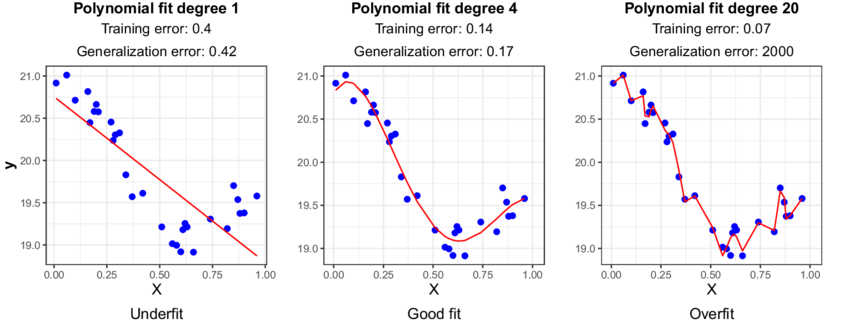

# Regularization and Data Augmentation

Written by Michael Wei and Sunny Sun.

## Section 1: Motivation Behind Regularization

Complex models such as deep neural networks can **overfit** the training data, meaning they learn patterns—including noise—too specifically and fail to **generalize** to new data. Overfit models exhibit a large generalization gap, where training error is low but test error is high.

**Regularization** refers to techniques that help prevent overfitting and reduce the generalization gap, ultimately aiming to minimize the true loss. Regularization _adds a preference for simpler models or solutions_, which tend to generalize better even if they perform slightly worse on the training data.

This leads to the concept of the **bias–variance trade-off**, a fundamental idea in statistical learning theory. Model performance typically follows a U-shaped curve: as model complexity increases, test error initially decreases but eventually rises again due to overfitting.

  

**Figure 1:** _Variation of Bias and Variance with model complexity; more complex models overfit, while the simplest models underfit_ \([Scott Fortmann-Roe, 2012](https://scott.fortmann-roe.com/docs/BiasVariance.html))

The expected test error can be decomposed into three components using the classic **bias-variance decomposition**:

$$
\mathbb E[(y-\hat f(x))^{2}] = \underbrace{\bigl(\mathrm{Bias}[\hat f(x)]\bigr)^{2}}_{\text{Bias}^{2}}
+ \underbrace{\mathrm{Var}[\hat f(x)]}_{\text{Variance}} + \sigma_{\varepsilon}^{2}
$$

This decomposition highlights a key trade-off: simpler models have high bias and low variance, while more complex models have low bias but high variance. Regularization helps manage this trade-off by deliberately introducing bias to reduce variance, thereby improving generalization.

A classic illustrative case is **polynomial fitting**. Imagine fitting a high-degree polynomial to a small set of data points. It may pass through every point (achieving zero training error), but oscillate wildly between them—resulting in poor generalization and high test error. A regularized approach (or a lower-degree polynomial) avoids these oscillations, trading a small increase in training error for a substantial improvement in test error.

  

**Figure 2:** _Model Error vs. Training Set Size. Without regularization, the small-data regime model fits training data perfectly but has high test error. With more data or regularization, test error becomes more manageable_ \([Badillo et al., 2020](https://www.researchgate.net/figure/llustration-of-the-underfitting-overfitting-issue-on-a-simple-regression-case-Data_fig2_339680577))

> **Empirical Risk Minimization (ERM)** focuses solely on minimizing the average loss over the training data:
>
> $$
> \mathbf{w} = \arg\min_{\mathbf{w}} \mathcal{L}(\mathbf{w}) = \frac{1}{n} \sum_i \ell(\mathbf{w}, \mathbf{x}_i, y_i)
> $$
>
> **Regularized Empirical Risk Minimization (Regularized ERM)** extends this by incorporating a regularization term to control model complexity. Instead of minimizing just the empirical loss, we optimize the following objective:
>
> $$
> \mathbf{w} = \arg\min_{\mathbf{w}} \left[ \mathcal{L}(\mathbf{w}) + \lambda \cdot r(\mathbf{w}) \right],
> $$
>
> where $r(\mathbf{w})$ measures the complexity of the model (e.g., via L1 or L2 norms), and $\lambda$ is a hyperparameter that controls the strength of regularization. This encourages simpler models and helps prevent overfitting.

In deep learning, the bias–variance trade-off doesn’t always behave as expected. Surprisingly, very large models can sometimes achieve low training _and_ low test error—an effect known as **deep double descent** (discussed later). This phenomenon challenges classical assumptions, yet regularization remains a central tool to ensure robust generalization, especially in the small data or high-noise regimes.

With the motivation for regularization established, we now explore specific techniques commonly used in deep learning to reduce overfitting and improve generalization.

## Section 2: Regularization Techniques in Deep Learning

Modern deep networks often employ multiple regularization techniques simultaneously to combat overfitting in order to minimize the loss function. Key techniques include **L1/L2 penalties**, **dropout**, and **early stopping**.

---

### L1 and L2 Regularization

L1 regularization, also known as **lasso**, adds the penalty $$\lambda|w|_1 = \lambda\sum_i |w_i|$$ to the loss. This encourages many weights to become exactly zero (sparse solution) since the L1 penalty increases linearly with weight magnitude with no smooth threshold around 0. L1 can act as a feature selector by eliminating less important weights. In contrast to L2, L1 tends to concentrate weight on a subset of features/neurons and zero-out the rest.

> L1 regularization encourages **sparsity** – it drives many weights to exactly 0, effectively pruning the model. L2 regularization instead **penalizes large weights** more than small ones, yielding a more small-weight solution without forcing zeros. In practice, L2 is more commonly used for deep nets (it’s easier to optimize as it’s differentiable everywhere), while L1 is used when sparsity is desired (e.g. for feature selection or compression).

L2 regularization, also known as **ridge regression**, adds the penalty term $$\frac{\lambda}{2} |w|_2^2$$ to the loss function. This discourages large weights by continuously pulling them toward zero. In practice, this is often implemented by modifying the gradient: each weight $w$ is decayed proportionally to its size. L2 regularization tends to **spread out weights** and keep them small, but it rarely drives them exactly to zero. Conceptually, it corresponds to a **Gaussian prior** on the weights, encouraging them to remain small.

In stochastic gradient descent (SGD), L2 regularization modifies the loss function directly and results in the following update rule:
$$\mathbf{w}_{t+1} = \mathbf{w}_t - \eta \nabla \mathcal{L}^{\text{reg}}(\mathbf{w}_t) = \mathbf{w}_t - \eta \nabla \mathcal{L}(\mathbf{w}_t) - \eta \lambda \mathbf{w}_t$$
This means the optimizer treats the regularization term **as part of the loss**, and thus it is scaled by the learning rate and interacts with any adaptive mechanisms (such as momentum or per-parameter learning rates).

In contrast, **weight decay** applies the shrinkage to weights **independently of the loss**:
$$\mathbf{w}_{t+1} = (1 - \lambda)\mathbf{w}_t - \eta \nabla \mathcal{L}(\mathbf{w}_t) = \mathbf{w}_t - \eta \nabla \mathcal{L}(\mathbf{w}_t) - \lambda \mathbf{w}_t$$
While these expressions may look similar for SGD, they differ fundamentally in how the decay interacts with the optimizer. Weight decay is implemented **outside the gradient computation**, meaning it does **not** get scaled or adapted by optimizer internals.

  

**Figure 3:** _Weight Decay and L2 Regularization. In L2 regularization, the optimizer treats regularizer just like the loss but in weight decay the regularizer is independent of optimizer's adaptive scaling_ ([Loshchilov et al., 2019](https://arxiv.org/pdf/1711.05101))

This distinction is especially important for **adaptive optimizers** like Adam. In these optimizers, L2 regularization is subject to the optimizer’s adaptive rescaling (e.g., per-parameter learning rates), while **weight decay** can be applied directly to the weights and is unaffected by such adaptations. As a result, L2 regularization and weight decay yield **different behaviors** in adaptive settings—this is the motivation behind optimizers like **AdamW**, which decouple weight decay from the gradient-based update.

  

**Figure 4:** _L1 and L2 Regularization_ ([Xiaoli Chen, 2018](https://www.linkedin.com/pulse/intuitive-visual-explanation-differences-between-l1-l2-xiaoli-chen))

The table below summarizes the optimization problems and corresponding gradient update rules for models trained with no regularization, L1 regularization (Lasso), and L2 regularization (Ridge):

| **Regularization** | **Optimization Problem**                                                                                 | **Gradient Update**                                                                                                               |
| ------------------ | -------------------------------------------------------------------------------------------------------- | --------------------------------------------------------------------------------------------------------------------------------- |
| None               | $\underset{\mathbf{w}}{\arg\min} \, \mathcal{L}(\mathbf{w}, D)$                                          | $\mathbf{w}\_{t+1} = \mathbf{w}\_t - \alpha \nabla \mathcal{L}(\mathbf{w}\_t, D) $                                                |
| L1 (Lasso)         | $\underset{\mathbf{w}}{\arg\min} \, \mathcal{L}(\mathbf{w}, D) + \lambda \|\mathbf{w}\|\_1 $             | $\mathbf{w}\_{t+1} = \mathbf{w}\_t - \alpha \nabla \mathcal{L}(\mathbf{w}\_t, D) - \alpha \lambda \, \text{sign}(\mathbf{w}\_t) $ |
| L2 (Ridge)         | $\underset{\mathbf{w}}{\arg\min} \, \mathcal{L}(\mathbf{w}, D) + \frac{\lambda}{2} \|\mathbf{w}\|\_2^2 $ | $\mathbf{w}\_{t+1} = \mathbf{w}\_t - \alpha \nabla \mathcal{L}(\mathbf{w}\_t, D) - \alpha \lambda \mathbf{w}\_t $                 |

**Table 1:** _Gradient Descent Update Rules for Different Regularization Methods_

---

### Dropout

Dropout is a **stochastic** regularization method designed to improve the **generalization** of neural networks by randomly _dropping out_ a subset of neurons during each forward pass of training. Rather than always using the full network, dropout temporarily disables each neuron with probability $1 - p$, where $p$ is typically between 0.5 and 0.8. This means that each neuron is independently kept with probability $p$, and during that iteration, any dropped neuron contributes nothing to the output.

This randomness encourages the network to learn more **redundant** and **robust** representations. Since no individual neuron can be relied upon to always be active, the model is forced to distribute the learning of important features across many units. This redundancy reduces the risk of **co-adaptation**, where multiple neurons become overly dependent on one another to function effectively. By eliminating such dependencies, dropout drives the model to build alternative, independent pathways for representing knowledge.

Viewed from another perspective, dropout simulates the training of a vast **ensemble** of sub-networks. Each unique combination of retained neurons forms a different architecture, sharing weights but differing in active units. In fact, with $n$ neurons, there are $2^n$ possible subnetworks—an astronomical number. Although we don't explicitly train each sub-model, dropout implicitly averages over many of them. During inference, we cannot rely on this stochasticity, so instead, we approximate the ensemble’s prediction by using the full network with **adjusted activations** to reflect the average behavior observed during training.

To maintain consistent output scales between training and testing, a strategy called **inverted dropout** is commonly used. During training, if a neuron is kept with probability $p$, its activation is scaled by $1/p$. This ensures that the expected output of each neuron remains constant, even when some units are dropped. Then, at test time, we do not drop any neurons; instead, we use the full network without scaling, relying on the fact that the activations were already adjusted during training. This allows the model to produce **stable** and **calibrated** outputs regardless of the dropout behavior seen in training.

For example, consider a single neuron receiving inputs $x$ and $y$ with corresponding weights $w_1$ and $w_2$. During training with dropout (say, with a dropout probability of 0.5), each input can be randomly dropped with equal probability. As a result, we compute the expected activation by averaging over all possible dropout combinations. This yields:

$$E[a] = \frac{1}{4}(w_1x + w_2y) + \frac{1}{4}(w_1x + 0y) + \frac{1}{4}(0x + 0y) + \frac{1}{4}(0x + w_2y) = \frac{1}{2}(w_1x + w_2y)$$

At test time, however, we use the full network without dropout but compensate for the higher activation by scaling the weights (or activations) by the dropout probability. So instead of dropping units, we directly compute:

$$E[a] = w_1x + w_2y$$

and then multiply the result by 0.5 (the keep probability), ensuring the expected output remains consistent with the training behavior.

  

**Figure 5:** _Dropout Neural Net Model. Comparing a standard network vs. the same network with random units (connections) dropped. **Left**: Standard Neural Net with 2 hidden layers. **Right**: Thinned net produced by applying dropout to the network._ ([Srivastava et al., 2014](https://www.cs.toronto.edu/~rsalakhu/papers/srivastava14a.pdf))

> Srivastava et al. (2014) introduced dropout and demonstrated significant reduction in **overfitting**, thereby improving **generalization**. For example, in neural nets trained on limited data, dropout yielded much lower test errors than no dropout (see _dropout effectiveness graph_). It’s especially useful in cases with many **parameters** and relatively little data. However, too high a dropout rate can underfit – common values are 0.5 for fully-connected layers and 0.2–0.3 for convolutional layers (where spatial redundancy is high). Always disable dropout when **evaluating/predicting** (it’s a training-time technique only).

  

**Figure 6:** _Test error of different architectures with and without dropout._ ([Srivastava et al., 2014](https://www.cs.toronto.edu/~rsalakhu/papers/srivastava14a.pdf))

---

### Early Stopping

Early stopping is a highly effective **regularization** strategy that works by monitoring the performance of a model on a held-out **validation** set during training. Instead of continuing to train the model until the training loss fully converges, we stop once the validation error ceases to improve—often after a small number of epochs (set by a _patience_ parameter) without progress. The model checkpoint corresponding to the lowest validation error is then selected as the final model.

The main effect of this approach is that it halts optimization at the point where the model achieves the best **generalization**, just before it begins to **overfit** the training data. While training loss tends to decrease monotonically, validation loss typically follows a U-shaped curve: it drops initially, then starts increasing as the model becomes too tailored to the training data. By stopping early—at the bottom of this curve—we prevent the model from reaching the overfitting regime and capture its best generalization capacity.

This behavior is rooted in how models **learn over time**. In the early stages of training, the network captures broad, meaningful **patterns** from the data. As training progresses, however, the model may start to memorize noise or spurious correlations specific to the training set. By interrupting the process before this memorization phase dominates, early stopping effectively limits the model’s functional capacity. This serves as an **implicit constraint** on the model’s complexity, similar in effect to more formal regularization techniques.

In practice, early stopping is simple to implement and widely adopted in deep learning workflows. It requires setting aside a **validation** set to track progress, which may be challenging if data is extremely limited. However, when feasible, it provides an **adaptive**, data-driven form of regularization. Unlike techniques that impose a fixed penalty on model weights, early stopping dynamically responds to the learning dynamics, pausing training precisely when it is most beneficial. It is also highly **complementary** to other forms of regularization, and in many cases, used in conjunction with them for optimal results.

> Always consider using **early stopping** in training deep nets. It usually yields a better model than training until training loss convergence. Monitor **validation loss/accuracy** each epoch; when improvement stalls or reverses, stop. This not only gives better generalization but also saves training time by not over-training.

  

**Figure 7:** _Early Stopping. Training loss continues to decrease, but validation loss begins to rise, indicating overfitting. Training should be stopped at the point where validation loss is minimized._ ([Julien Despois, 2018](https://hackernoon.com/memorizing-is-not-learning-6-tricks-to-prevent-overfitting-in-machine-learning-820b091dc42))

### Other Regularization Strategies

- **Max-Norm constraints:** Some networks (especially older practice in CNNs) explicitly constrain the L2 norm (Euclidean) of incoming weight vectors for each neuron (e.g. clamp $|w_i|_2$ to a fixed value). If the norm exceeds this threshold during training, the weight vector is rescaled to bring it within the acceptable range.This prevents any neuron from having excessively large weights which can lead to overfitting. This regularization technique encourages the network to learn more generalized features, improving its performance on unseen data

- **Ensemble methods:** Training multiple models and averaging their predictions (an ensemble) is a way to reduce variance and improve generalization (though at high computational cost). Ensembling is not a _single-model_ regularizer but it’s a powerful approach to combat overfitting. While computationally expensive, ensemble methods are among the most effective strategies for combating overfitting.

  

**Figure 8:** _Ensemble Methods. Combines predictions from multiple independently trained models to produce a final output, typically through averaging (for regression) or majority voting (for classification)._ ([Abdelwahab et al., 2022](https://www.researchgate.net/figure/Ensemble-neural-network-architecture_fig4_361508509))

- **Data-dependent regularizers:** In some cases, one might add a term to the loss that encodes some prior knowledge, e.g. encouraging smoothness of predictions or penalizing certain complexity in features. These are problem-specific but follow the same principle of constraining the solution space.

While these regularization methods constrain model complexity directly, their effectiveness also depends on how they interact with optimization algorithms like Adam and SGD which we will cover next.

---

### Optimizers and Regularization: Adam vs. AdamW

In traditional machine learning, optimization problems are often **convex**, meaning the loss surface has a single global minimum. In such cases, gradient descent is guaranteed to find the optimal solution, assuming proper step sizes. However, deep neural networks pose **non-convex** optimization problems, characterized by numerous **local minima** and **saddle points**. There are **no theoretical guarantees** that gradient-based methods will find the best possible solution. As a result, different optimization algorithms—like SGD, Adam, or AdamW—can converge to **different minima**, making their interaction with regularization techniques especially important.

In deep learning, **optimizers** do more than just update weights—they also interact with **regularization strategies** in subtle and sometimes counterintuitive ways. This is particularly true for adaptive optimizers like Adam, where standard L2 regularization (often implemented via weight decay) behaves differently than expected due to the optimizer’s internal mechanics.

**Adam**, like RMSProp, adapts learning rates on a per-parameter basis using estimates of past **gradient moments**. This adaptivity means that when we apply L2 regularization by adding a term like $\lambda w$ to the gradient—effectively implementing weight decay through the loss function—the strength of regularization becomes entangled with each parameter’s learning rate. Since Adam divides the gradient by a moving average of squared gradients, the same $\lambda w$ term can exert varying levels of influence depending on the variance in gradient history. Parameters with highly variable gradients may receive weaker regularization than intended, making the overall effect **inconsistent**.

This coupling between regularization and the optimizer’s internal scaling led to the insight that L2 regularization is not equivalent to **weight decay** in Adam. Loshchilov and Hutter (2019) addressed this mismatch by introducing **AdamW**, a simple yet impactful modification to Adam that **decouples weight decay from the gradient update**. Instead of modifying the gradient directly, AdamW applies weight decay as a separate step: after the usual Adam update, each parameter is scaled by a constant factor $(1 - \eta \lambda)$. This ensures **uniform shrinkage** of weights across the model, regardless of how gradients behave.

The effect of this **decoupling** is significant. Because weight decay in AdamW is no longer mediated by the gradient normalization, it behaves **predictably** and consistently across all weights. This regularization strategy helps prevent **overfitting** and improves generalization, especially in deep models with large capacity. In practice, experiments show that AdamW often matches or surpasses the generalization performance of **SGD** with momentum in computer vision and language tasks.

> **Decoupled weight decay** is more effective than naive L2 regularization in adaptive optimizers. When using Adam, always prefer an implementation that explicitly supports AdamW or decoupled weight decay.

There’s also a practical side to this: many deep learning libraries historically labeled **L2 regularization** as `weight_decay` even when it was implemented in a coupled way. This caused **confusion**, as increasing the weight decay parameter might not yield the expected regularization effect due to interactions with Adam’s learning rate adaptation. AdamW resolves this ambiguity and allows tuning weight decay independently from other **hyperparameters** like learning rate or momentum.

Finally, while AdamW brings adaptive optimizers closer to SGD in terms of generalization, some practitioners still switch to **SGD** in the final stages of training. This is based on the observation that SGD often settles into **flatter minima**, which are associated with better generalization. Thus, optimizer choice itself—Adam, AdamW, SGD—can be seen as a form of **implicit regularization**.

  

**Figure 9:** _Adam & AdamW. Learning curves and generalization results for Adam and AdamW ResNet trained on CIFAR-10._ ([Loshchilov et al., 2019](https://arxiv.org/pdf/1711.05101))

While optimizer choice and training dynamics influence generalization, another powerful axis of regularization lies in the data itself—via data augmentation

---

### Data Augmentation

Data augmentation is a regularization technique that enhances the **diversity** of a training dataset by applying **transformations** to existing examples. This method generates new, synthetic samples that preserve the original labels, serving as a powerful form of regularization. In doing so, it reduces overfitting by encouraging the model to generalize across plausible variations of the input data rather than memorizing specifics.

The motivation behind data augmentation comes from our prior knowledge of task-relevant **invariances**. For instance, flipping an image of a cat horizontally does not change the fact that it is still a cat. By introducing such transformations during training, we explicitly encode these invariances into the model. This forces the network to become invariant to such changes, rather than relying on **spurious** cues present in the original dataset. In this sense, augmented data acts as _free_ additional data that guides more robust learning.

For image data, augmentation typically involves applying **label-preserving** geometric or photometric transformations. Geometric changes might include horizontal flips, small-angle rotations, zooming, cropping, and translations—each intended to simulate natural variations without altering the image’s semantic content. Photometric adjustments such as brightness or contrast shifts, color perturbations, and the addition of **noise** or blur serve a similar purpose by mimicking real-world conditions like lighting changes or sensor noise. One particularly effective augmentation strategy is **Cutout**, where a random rectangular region of the image is masked out. This compels the model to rely on the remaining parts of the image, encouraging it to form more holistic representations.

  

**Figure 10:** _Data Augmentation._ ([Pranjal Ostwal, 2023](https://pranjal-ostwal.medium.com/data-augmentation-for-computer-vision-b88b818b6010))

Beyond these standard augmentations, more advanced methods have emerged that blend information from multiple samples. **Mixup**, introduced by Zhang et al. (2017), generates new training examples by linearly **interpolating** between two images and their corresponding labels. Specifically, if $x_i$ and $x_j$ are two images and $y_i$, $y_j$ their labels, then the new sample is defined as:

$$\tilde{x} = \lambda x_i + (1 - \lambda) x_j, \quad \tilde{y} = \lambda y_i + (1 - \lambda) y_j$$

with $\lambda \in [0, 1]$ sampled from a **beta distribution**. The resulting images and labels are ambiguous, forcing the model to learn smoother decision boundaries and improving generalization under noisy conditions.

  

**Figure 11:** _Mixup: Synthesizing new samples by combining two existing data points._ ([Zhang et al., 2017](https://arxiv.org/pdf/1710.09412))

**CutMix** (2019) offers a more **spatially grounded** alternative by cutting a patch from one image and pasting it onto another. The label is then adjusted proportionally based on the area of the patch. This approach helps the model learn from partial evidence and increases robustness to **occlusions**—common in real-world scenarios.

  

**Figure 12:** _CutMix. Visualizing ‘Saint Bernard’ and ‘Miniature Poodle’ samples using Mixup, Cutout, CutMix Augmentation Techniques._ ([Yun et al., 2019](https://arxiv.org/pdf/1905.04899))

Building on these ideas, automated augmentation strategies like **AutoAugment** and **AugMix** explore combinations of augmentation operations using learned or fixed policies. These techniques further push the boundary by optimizing augmentation pipelines to match the needs of the target task, yielding improved **accuracy** and **robustness** in many state-of-the-art vision models.

Augmentation in **natural language processing** presents unique challenges. Small perturbations can easily alter semantics or break grammatical structure. Still, several methods have been devised to safely augment textual data. **Synonym replacement**, for example, substitutes words with semantically similar alternatives while preserving sentence meaning. More aggressive techniques—such as word insertion, deletion, or swapping—require careful tuning to avoid introducing noise that changes the label. **Back-translation**, where a sentence is translated to another language and back, often results in paraphrased variations that maintain the original intent.

**Noise injection** can also be applied to textual or structured data, especially in character-level models. Introducing small **typos** or character swaps can help improve robustness, though care must be taken to ensure these changes do not distort the underlying semantics.

> For text tasks, incorrect augmentation can be harmful. For instance, replacing _good_ with _bad_ in **sentiment analysis** would flip the label and mislead the model.

The impact of data augmentation is particularly profound in **vision models**. Strong augmentation regimes have been shown to match the benefits of significantly larger datasets. For example, when training **Vision Transformers (ViTs)**, well-designed augmentation strategies—combined with regularization—achieved the same performance as models trained on ten times more data. This demonstrates the power of **_data-side regularization_**: carefully augmenting your training set can substitute for massive dataset collection efforts.

> **Steiner et al. (2022)** found that Vision Transformers trained with aggressive augmentation and regularization matched the performance of models trained on datasets an order of magnitude larger. This result highlights the value of leveraging domain-specific transformations to improve **generalization** without increasing data volume. Whenever possible, consider data augmentation not as an optional preprocessing step, but as a **critical** component of modern machine learning workflows.

Alongside data augmentation, which enhances the dataset itself, we now turn to normalization techniques that regularize model behavior during training.

---

## Section 3: Normalization Techniques

While data augmentation tackles overfitting from the data perspective, normalization methods act within the model architecture to stabilize training and implicitly regularize learning. Normalization layers are tool that, while primarily intended to stabilize and speed up training, also have a regularization effect. They re-scale and re-center layer inputs to have consistent distributions, which can reduce internal covariate shift and make optimization easier.

---

### Batch Normalization (BatchNorm)

Batch Normalization, introduced by Ioffe and Szegedy (2015), is a technique that normalizes the **activations** of a layer across each mini-batch during training. For a given activation vector $x$, the method computes the mean and variance of the current mini-batch, normalizes the activations, and then applies a learned scale and shift:

> **Input:** Values of $x$ over a mini-batch: $\mathcal{B} = \{x_1, \dots, x_m\}$; parameters to be learned: $\gamma, \beta$
>
> **Output:** $\{ y_i = \text{BN}_{\gamma, \beta}(x_i) \}$
>
> $$
> \mu_{\mathcal{B}} \leftarrow \frac{1}{m} \sum_{i=1}^{m} x_i \quad \text{// mini-batch mean}
> $$
>
> $$
> \sigma^2_{\mathcal{B}} \leftarrow \frac{1}{m} \sum_{i=1}^{m} (x_i - \mu_{\mathcal{B}})^2 \quad \text{// mini-batch variance}
> $$
>
> $$
> \hat{x}_i \leftarrow \frac{x_i - \mu_{\mathcal{B}}}{\sqrt{\sigma^2_{\mathcal{B}} + \epsilon}} \quad \text{// normalize}
> $$
>
> $$y_i \leftarrow \gamma \hat{x}_i + \beta \equiv \text{BN}_{\gamma, \beta}(x_i) \quad \text{// scale and shift}$$

**Algorithm 1:** _Batch Normalization Algorithm_ [Ioffe et al., 2015, https://arxiv.org/pdf/1502.03167]

This formulation allows the model to recover the **identity mapping** or learn alternative distributions if needed, depending on the values of $\gamma$ and $\beta$.

During training, the statistics used for normalization are computed from the current **mini-batch**. This means that the output for the same input can vary slightly depending on which batch it is in. While this introduces a small amount of **noise**, it also serves as a mild form of regularization, similar in spirit to dropout.

When the model is deployed for **inference**, randomness from mini-batch variation is no longer desirable. To address this, BatchNorm uses a **running average** of the batch-wise mean and variance collected during training. These stored averages are updated using the formulas:

$$
\mu_{\text{inf}} = \lambda \mu_{\text{inf}} + (1 - \lambda) \mu_{\mathcal{B}}, \quad \sigma^2_{\text{inf}} = \lambda \sigma^2_{\text{inf}} + (1 - \lambda) \sigma^2_{\mathcal{B}}
$$

where $\mu_{\mathcal{B}}$ and $\sigma^2_{\mathcal{B}}$ are the batch mean and variance, respectively, and $\lambda$ is a momentum term. These running statistics are then used to normalize inputs consistently at test time, ensuring **stable** and **deterministic** behavior across examples.

BatchNorm was originally proposed to reduce **internal covariate shift**, which refers to the changing distribution of layer inputs during training. By normalizing inputs to each layer, the method ensures a more **stable** input distribution, making training more efficient. This stability allows for the use of higher **learning rates** and reduces sensitivity to initialization. The normalization also indirectly injects noise, which improves **generalization**, though this effect is usually milder than explicit regularization techniques.

One of the most significant contributions of BatchNorm is how it alters **training dynamics**. By improving the conditioning of the **optimization** problem, it enables the use of larger learning rates. Larger learning rates allow optimizers to explore flatter regions of the **loss surface** and escape sharp minima, often resulting in better generalization.

This behavior is partially explained by the noise characteristics of stochastic gradient descent (SGD). As shown by Bjorck et al. (2018), the noise of the gradient estimate scales with the learning rate:

$$
\alpha \nabla_{SGD}(x) = \alpha \nabla \ell(x) + \frac{\alpha}{|B|} \sum_{i \in B} (\nabla \ell_i(x) - \nabla \ell(x))
$$

Here, the first term is the true gradient scaled by the learning rate $\alpha$, and the second is an **error term** due to mini-batch sampling. While the expected value of the error term is zero:

$$
\mathbb{E} \left[\frac{\alpha}{|B|} \sum_{i \in B} (\nabla \ell_i(x) - \nabla \ell(x)) \right] = 0
$$

its variance is nonzero and scales with $\alpha^2$. In fact, we can bound the expected squared deviation of the noisy gradient from the true gradient:

$$
\mathbb{E}\left[\|\alpha \nabla \ell(x) - \alpha \nabla_{SGD}(x)\|^2\right] \leq \frac{\alpha^2}{|B|} C
$$

where $C = \mathbb{E}[\|\nabla \ell_i(x) - \nabla \ell(x)\|^2]$. This implies that **larger learning rates amplify the gradient noise**, which can act as a kind of implicit regularization, guiding the model away from sharp minima.

If a small learning rate is used, the variance of this noise shrinks, and the benefit of BatchNorm largely disappears. Empirical results from Bjorck et al. support this view: the benefits of BatchNorm diminish at lower learning rates. In contrast, using BatchNorm with a larger learning rate not only accelerates **convergence** but also improves final test performance by guiding the model toward **flatter minima**. In many practical settings, BatchNorm is critical for successfully training very **deep networks** that would otherwise suffer from optimization instability.

> BatchNorm’s effectiveness depends on having a sufficiently large **batch size**. When batch sizes are too small, the estimates of mean and variance become **noisy**, degrading both training and inference performance. In extreme cases, such as batch size 1, BatchNorm fails entirely. In such scenarios, alternatives like **Group Normalization** or **Layer Normalization**, which do not depend on batch statistics, are often preferred. Additionally, during inference, it is crucial to ensure that the running averages have been adequately **estimated**—sometimes requiring aggregation over the full training set if the mini-batches are too noisy.

  

**Figure 13:** _Batch Normalization. Larger learning rates yield higher test accuracy for Batch Normalization networks._ ([Bjorck et al., 2018](https://arxiv.org/pdf/1806.02375))

---

### Layer Normalization (LayerNorm)

Layer Normalization is a regularization technique that normalizes the **activations** of a neural network layer **within a single data sample**, rather than across a batch. This approach contrasts with Batch Normalization, which computes statistics over multiple samples in a batch. In LayerNorm, for each input sample, the normalization is applied across the **feature dimensions**, making the method independent of the batch size or composition.

To understand how it works, consider an input vector $h = [h_1, h_2, \ldots, h_d]$ representing the **activations** of a layer for one sample with $d$ features. The **mean** and **variance** are computed as:

$$
\mu_L = \frac{1}{d}\sum_{j=1}^d h_j, \quad \sigma_L^2 = \frac{1}{d}\sum_{j=1}^d (h_j - \mu_L)^2
$$

Each feature is then **normalized** using:

$$
\hat{h}_j = \frac{h_j - \mu_L}{\sqrt{\sigma_L^2 + \epsilon}}
$$

Finally, the normalized values are scaled and shifted using learnable parameters $\gamma$ and $\beta$:

$$
y_j = \gamma \hat{h}_j + \beta
$$

This formulation ensures that for every sample, the output **activations** are normalized based on that sample's own **feature statistics**.

While BatchNorm normalizes each feature across the batch dimension—making it highly effective when **batch statistics** are stable and informative—LayerNorm performs normalization across features within each sample. This distinction becomes crucial in domains where batch-wise consistency cannot be assumed.

The motivation behind LayerNorm is particularly clear in **sequence models**. In recurrent neural networks (RNNs) or transformers, input sequences vary in length, and batch sizes may fluctuate significantly—sometimes down to a single sample, especially during **inference** or **online learning**. In these cases, relying on batch statistics as BatchNorm does becomes impractical. LayerNorm sidesteps this issue by being completely **sample-local**, providing consistent behavior regardless of the batch configuration.

LayerNorm is an essential component in transformer architectures, which avoid BatchNorm entirely. In **NLP tasks**, where sequence lengths vary and data often exhibit **non-i.i.d.** properties, stable batch statistics cannot be guaranteed. By normalizing each token’s embedding based on its own feature distribution, LayerNorm improves training stability and model convergence without introducing cross-sample dependencies.

The trade-off between BatchNorm and LayerNorm depends heavily on the **domain**. In **computer vision**, BatchNorm performs exceptionally well because images within a batch provide rich, consistent statistics. It enhances convergence, stabilizes training, and introduces beneficial noise during training due to mini-batch fluctuations. However, BatchNorm's reliance on batch composition means that its behavior can vary significantly if the batch distribution shifts—this can pose problems in settings like **reinforcement learning** or **streaming inference**.

In **natural language processing** or **time-series analysis**, LayerNorm is typically favored. It avoids the pitfalls of batch dependency, handles varying input lengths gracefully, and ensures that normalization behaves consistently, even when batch sizes are small or non-existent.

Other normalization variants offer compromises. **_Group Normalization_** divides features (e.g., channels in CNNs) into groups and normalizes within each group for each sample, blending aspects of BatchNorm and LayerNorm. This has proven effective in vision tasks with small batch sizes, such as **GANs** or **object detection**. **_Instance Normalization_**, often used in **style transfer**, is an extreme case where each feature map is normalized independently, helping to remove style-specific variations from individual images.

**Normalization** methods do more than just stabilize training. They help smooth the **optimization landscape**, making it easier for gradient descent to find better minima. This can lead to faster convergence and improved generalization.

> While normalization layers like BatchNorm and LayerNorm act as **implicit regularizers**, they should be seen as complementary to techniques like **dropout** and **weight decay**—not replacements.

In practice, most state-of-the-art architectures rely on BatchNorm in convolutional networks and LayerNorm in transformer-based models, using them as foundational tools to ensure training stability and performance across a wide range of tasks.

  

**Figure 14:** _Normalization Methods. N is the batch axis, C is the channel axis, and (H, W) are the spatial axes. Blue pixels are normalized by the same mean and variance._ ([Wu et al., 2018](https://arxiv.org/pdf/1803.08494))

Beyond explicit methods like dropout or normalization, deep learning also benefits from implicit forms of regularization that emerge from optimization dynamics and model design.

---

### Implicit and Algorithmic Regularization

Beyond deliberate techniques like weight decay or dropout, neural networks often benefit from **implicit regularization**—effects that arise from the **training algorithm** and model architecture rather than from explicit penalties in the loss function. These influences shape the learned solutions in ways that promote generalization, even in highly over-parameterized settings.

One of the most studied sources of implicit regularization is the stochastic nature of gradient-based optimization, particularly **Stochastic Gradient Descent (SGD)**. When networks are trained with small mini-batches and data shuffling, SGD introduces **noise** into the optimization process. This noise turns out to be beneficial: neural networks trained with SGD can generalize well even without explicit regularizers. Remarkably, such models can memorize completely random labels if forced to—but when trained on real data, they often find solutions that generalize. In simple linear systems, SGD is known to converge to the **minimum-norm** solution of $Xw = y$ when multiple solutions exist. This minimum-norm preference reflects a broader bias toward simpler models.

The generalization behavior of deep networks—even without explicit regularization—was powerfully demonstrated by **Zhang et al. (2017)**. Their results showed that deep networks can memorize random labels, achieving near-zero training error. However, the same architectures, when trained on natural labels, generalize well despite the lack of explicit constraints. This suggests that SGD and **model architecture** impose a strong implicit bias. In practice, SGD's incremental and noisy updates tend to prefer **flatter regions** of the loss landscape—solutions that are more robust to perturbations and often more generalizable.

This leads to the **flat minima** vs. **sharp minima** hypothesis. In deep learning, the loss landscape is highly **non-convex**, containing many local minima that are not equivalent in terms of generalization. A flat minimum is characterized by a broad, shallow region in parameter space where the loss remains low under small changes. Sharp minima, in contrast, are narrow valleys where small shifts can cause large increases in loss. Because SGD incorporates noise (especially with small batches), it struggles to settle into sharp minima. As a result, it naturally gravitates toward flatter regions. Empirical studies, such as those by **Keskar et al. (2017)**, found that smaller batch sizes lead to flatter minima and better generalization, while large-batch training often converges to sharper minima that perform worse on test data.

  

**Figure 15:** _Flat vs. Sharp Minima. Generalization Capability._ ([Keskar et al., 2017](https://arxiv.org/pdf/1609.04836))

This implicit bias also interacts with **over-parameterization**. Modern neural networks often contain more parameters than training samples, which by classical theory should make them prone to overfitting. And indeed, they can fit arbitrary data. But when trained on structured, real-world data using SGD, they often avoid pathological overfitting. The explanation lies in the fact that over-parameterization gives rise to many possible solutions, and the **optimization algorithm** tends to select a subset of these that generalize. This phenomenon—where capacity itself does not guarantee poor generalization—is sometimes referred to as **implicit regularization** through over-parameterization. Formally, this can be described using the **algorithmic regularization** framework:

$$
\mathbf{w} = \arg\min_{\mathbf{w}} \mathcal{L}(\mathbf{w}) + \lambda \cdot r_{\mathcal{A}}(\mathbf{w})
$$

where $r_{\mathcal{A}}(\mathbf{w})$ reflects the model complexity implicitly shaped by the learning algorithm $\mathcal{A}$, rather than an explicitly defined penalty.

Another contributor is the **architecture** itself. Neural network designs carry **inductive biases** that constrain the function space they can represent. Convolutional networks, for example, are built on assumptions of locality and translation invariance. These assumptions drastically reduce the effective complexity of the hypothesis space compared to fully-connected models operating on the same data. Similarly, architectural choices like **parameter sharing** (e.g., across spatial positions in CNNs or time steps in RNNs) serve as built-in regularizers by reducing the number of independently learnable parameters. These design choices make it easier for the model to discover generalizable patterns when the data respects those structural priors.

**Early stopping** can also be seen through the lens of implicit regularization. By halting training based on **validation performance** rather than full convergence, the learning process avoids entering overly complex regimes of the parameter space. In this view, early stopping is not a loss-based penalty but an optimization-based constraint that serves a similar purpose.

For a more theoretical example, consider **gradient-based training** of matrix factorization. Even without an explicit norm penalty, gradient descent on a simple two-layer linear network can implicitly minimize the **nuclear norm** of the factorized matrix. This suggests that optimization alone can drive low-complexity solutions. Such findings extend to other linear settings and hint at similar dynamics in more complex, nonlinear networks.

> The main insight from **Zhang et al. (2017)** is that **explicit regularization**—though often helpful—is neither strictly necessary nor sufficient for generalization in deep learning. Much of what governs generalization is embedded in the dynamics of training and the structure of the model. This does not mean we should abandon explicit regularizers altogether, but it highlights that they operate in tandem with powerful **implicit forces**. Relying entirely on implicit regularization is risky and often suboptimal, but understanding these effects is essential for interpreting model behavior and designing better training protocols.

---

### Deep Double Descent and Interpolation Regimes

In classical learning theory, increasing model complexity beyond a certain point leads to overfitting. This is typically visualized as a U-shaped test error curve: error initially decreases as the model gets more expressive, then increases as it starts to memorize the training data. However, recent advances in deep learning have revealed a more nuanced picture. When model capacity is pushed even further—well past the point where training error hits zero—test error can begin to **decrease again**, resulting in a phenomenon known as **double descent**.

This effect reshapes our understanding of the **bias-variance trade-off**. Traditionally, once a model begins to interpolate the training data perfectly, further increases in complexity are expected to worsen generalization. But with double descent, the opposite may happen. The test error, which peaks around the **interpolation threshold** (the point where training error is near zero), begins to fall again as the model enters a highly **over-parameterized** regime. In this regime, the model doesn’t just memorize—it starts to generalize well once more, aided by the implicit biases of the optimization process and the structure of the data.

The **double descent curve** illustrates this clearly. As model complexity increases, test error first falls (the classical descent), then rises sharply (overfitting near interpolation), and finally drops again as the model becomes extremely large. **Belkin et al. (2019)** were among the first to rigorously describe this behavior. They extended the classical risk curve to show that after variance explodes at the interpolation point, it can begin to fall again in an over-parameterized regime. This reframing reconciles modern empirical results with traditional theory, suggesting that the bias-variance trade-off isn’t a simple U-shape, but rather a more intricate landscape.

**Nakkiran et al. (2020)** built on this by demonstrating **deep double descent** in practical deep learning contexts. They observed the phenomenon in a variety of architectures—including ResNets, CNNs, and transformers—across tasks like image classification and language translation. What’s striking is that double descent does not only appear with increasing model size. It can also arise as a function of **training time** (e.g., training for more epochs initially worsens generalization, then improves it again) or **dataset size** (where more data can first hurt, then help, test performance with large models).

  

**Figure 16:** _Deep Double Descent. The test error initially follows the classical U-shaped curve as model capacity increases, but then rises again before descending a second time—a phenomenon known as double descent. This illustrates that increasing model size beyond the interpolation threshold can improve generalization, contrary to traditional bias-variance tradeoff intuition._ ([Nakkiran et al., 2019](https://arxiv.org/pdf/1912.02292))

Why it works comes down to the role of **implicit regularization**. Even though these large models are capable of memorizing the training data in many ways, the training dynamics often steer them toward solutions that generalize. In particular, when operating in the **interpolation regime** where the empirical loss $\mathcal{L}(h) \approx 0$, the optimization process effectively becomes:

$$
h = \arg\min_{h \in \mathcal{H}} \mathcal{L}(h) + \lambda \cdot r(h) \approx \arg\min_{h \in \{h : \mathcal{L}(h) \approx 0\}} r(h)
$$

Here, $r(h)$ represents some measure of complexity. This means that among all hypotheses that fit the data perfectly, the training process tends to select the one with minimal complexity. In other words, the **optimization algorithms** and **architectural priors** induce a preference for simpler, smoother functions—especially in the over-parameterized regime. This is why, despite having enough parameters to overfit completely, large models often don’t in practice.

The effect has important **implications**. It challenges the instinct to restrict model capacity to prevent overfitting. In many modern applications, particularly those involving large datasets and compute budgets, the best generalization is achieved not by holding back on capacity but by pushing it far beyond the interpolation threshold—into the **second descent** regime. However, this regime is not without its challenges. There’s often a narrow range between the peak of overfitting and the start of the second descent where performance can be particularly unstable. A model slightly too large may overfit badly, while a much larger one may generalize well, provided training and **regularization** are handled properly.

Consider a simple **example**. With 100 training points, a model with 10 parameters might underfit due to high bias. A model with 100 parameters may interpolate the data exactly, potentially overfitting and producing high test error. But a model with 1000 parameters—though vastly over-parameterized—has many ways to fit the data. If the **optimization process** favors solutions with lower complexity or smoother behavior (as SGD often does), it may converge on a solution that generalizes surprisingly well. This is the essence of the second descent.

> Double descent emphasizes the critical role of **implicit biases** in training. These biases help steer highly expressive models toward generalizable solutions, even when they are technically capable of overfitting. This explains why **massive models**—when paired with strong regularization and vast datasets—are behind many of today’s top-performing systems. Nonetheless, explicit regularization techniques still matter, particularly when navigating the sensitive transition between interpolation and the second descent regime.

  

**Figure 17:** _Classical vs. Modern Generalization. Traditional U-shaped test risk curves (left) give way to double descent behavior (right), where test risk decreases again beyond the interpolation threshold in over-parameterized models._ ([Belkin et al., 2019](https://www.cs.ubc.ca/labs/lci/mlrg/slides/dl_generalization.pdf))

---

### Gradient Clipping

Training very deep networks or recurrent models like RNNs often brings a familiar but serious issue: **exploding gradients**. When gradients grow excessively large during backpropagation, they can cause **numerical instability**—leading to wildly oscillating losses or even NaNs. This makes it difficult for the model to converge reliably. Gradient clipping is a straightforward yet effective technique to address this by constraining gradient values before they’re used in parameter updates.

The underlying problem often arises in models where many layers or time steps multiply gradients together, as in unrolled RNNs. In such cases, even a few large weights can cause the **gradient norm** to explode exponentially. When that happens, a single gradient descent update can be so large that it wipes out any learning progress, essentially corrupting the model’s parameters. This is especially prevalent in **sequence models** dealing with long dependencies or in reinforcement learning, where reward signals can fluctuate widely.

To avoid this, **gradient clipping** applies a cap to gradients before the optimizer update step. There are two common approaches:

**Clipping by value:** Each individual gradient component is constrained to fall within a predefined interval. For instance, forcing each $g_i$ to lie within $[-N, N]$ for some threshold $N$. Any component outside this range is clipped to the boundary. This approach is simple but treats each coordinate independently, which may distort the gradient’s direction.

**Clipping by norm:** This more widely used approach computes the global L2 norm of the entire gradient vector. If the norm exceeds a threshold $\tau$, the entire gradient is rescaled so that its norm equals $\tau$:

Certainly! Here's the fixed **note section** using your preferred format and keeping everything concise and clear:

> **Gradient Clipping Algorithm:**
>
> $$
> \text{if } \|\mathbf{g}\| > \tau :
> \quad \mathbf{g}' = \frac{\tau}{\|\mathbf{g}\|} \mathbf{g}
> $$
>
> $$
> \text{else:}
> \quad \mathbf{g}' = \mathbf{g}
> $$
>
> $$
> \tau: \text{ Max gradient norm}
> $$
>
> **Algorithm 2:** _Gradient Clipping Algorithm_ [Pascanu et al., 2013, [arxiv](https://arxiv.org/pdf/1211.5063)]

This method retains the **direction** of the gradient while reducing its **magnitude**, acting as a smoother and more stable constraint than per-coordinate capping.

The practical effect of clipping is to maintain **training stability** in the face of occasional spikes in gradient size. It doesn't directly enhance generalization performance, but without it, the training process may become chaotic or break down entirely. In this sense, clipping serves as a **guardrail**—allowing learning to proceed even in volatile regions of parameter space.

Gradient clipping is especially useful in models that are sensitive to instability, such as **LSTMs**, transformers, or policy networks in reinforcement learning. It's also a valuable tool when working with **deep architectures** or aggressive learning rates. While optimizers like Adam can help absorb some instability, clipping remains an important fallback when things go off the rails.

There’s a subtle but important distinction between gradient clipping and **regularization**. Clipping doesn't penalize complexity or directly constrain model capacity; instead, it ensures that gradient updates don't spiral out of control. You might think of it as preventing **implicit capacity explosion**, where a model becomes numerically unstable before any regularizer has a chance to act.

> Gradient clipping is primarily a fix for **optimization instability**—not a method to boost generalization. If you find that your model can only train when clipping is enabled, it likely means the system is otherwise at risk of divergence. Additionally, clipping shouldn’t be confused with **weight decay**. While clipping limits the _immediate gradient update_, weight decay continuously shrinks the weights themselves—a true form of regularization.

Both techniques can be used together. For instance, in **adversarial training** or GANs, it's common to apply clipping for stability while also using weight decay to manage capacity. However, excessive clipping can slow down learning by overly shrinking useful gradients. A good rule of thumb is to set the threshold just high enough that clipping only activates during **extreme gradient events**—rare but dangerous spikes.

> Over-clipping is counterproductive. If your **clip threshold** is too low, the model may train sluggishly or not at all. Always monitor how often clipping is triggered during training to calibrate this parameter effectively.

  

**Figure 18:** _Gradient Clipping prevents exploding gradients by capping the norm of the gradient vector._ ([Pascanu et al., 2013](https://arxiv.org/pdf/1211.5063))

---

## Section 4: Recap

Deep learning models are powerful but prone to overfitting, especially with limited or noisy data. Regularization helps improve generalization by preventing models from simply memorizing training data. However, too much regularization can cause underfitting, where the model fails to capture meaningful patterns. Therefore, it's crucial to use a combination of regularization techniques:

- **Weight decay** is a common regularization method. In **SGD**, it's typically implemented as **L2 regularization** by adding a penalty to the loss. In adaptive optimizers like **Adam**, use **AdamW** for proper decoupled weight decay.
- **L1 regularization** promotes sparsity by driving weights to exactly zero, making it useful for feature selection or model compression.
- **Max-norm constraints** limit the maximum norm of weight vectors helping prevent runaway weights and improve robustness in certain networks.
- **Ensemble methods** average predictions from multiple models to reduce variance and improve generalization, though at higher computational cost.
- **Dropout** is especially effective in fully-connected layers. Use moderate rates (0.3–0.5) when data is limited. In convolutional models with **BatchNorm**, dropout may be less necessary.
- **BatchNorm** (or **LayerNorm**, **GroupNorm**) is a standard practice in deep networks. It stabilizes and speeds up training while improving generalization.
- **Early stopping** is a _free_ regularizer—monitor validation performance and stop training when it plateaus.
- **Data augmentation** boosts performance, especially in vision tasks. It helps models generalize without modifying their architecture. Ensure label consistency and avoid test leakage.

> Use **multiple regularizers together**—they are complementary and often compound their effects.

The **training algorithm** itself also plays a regularizing role:

- **SGD with momentum** or **AdamW** can guide the model toward generalizable solutions.
- **Deep double descent** shows that over-parameterized models can generalize well due to implicit biases in optimization, challenging traditional bias-variance views.
- **Gradient clipping** prevents training instabilities, particularly in RNNs or when loss spikes occur.

## References

- Varsha Kishore, Justin Lovelace, Gary Wei, Christy Guan. _Regularization and Data Augmentation_. CS4782: Intro to Deep Learning, Cornell University, 2024. https://www.cs.cornell.edu/courses/cs4782/2025sp/slides/pdf/week2_2_slides.pdf
- Ian Goodfellow, Yoshua Bengio, Aaron Courville. _Deep Learning_. MIT Press, 2016. https://www.deeplearningbook.org/
- Kevin P. Murphy. Probabilistic Machine Learning: An Introduction. MIT Press, 2022. https://probml.github.io/pml-book
